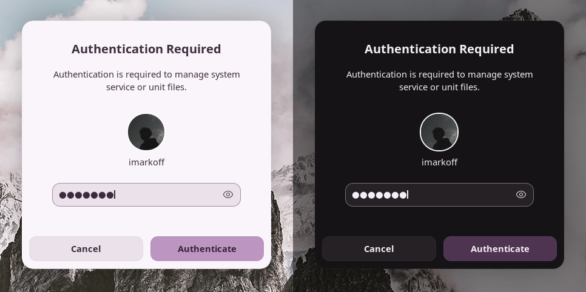

# Marble shell theme
Shell theme for GNOME DE. Based on https://www.pling.com/p/1939902/.


## 🏞 Screenshots

<details><summary>Click me 🐈</summary>

Icon theme: https://github.com/vinceliuice/Colloid-icon-theme
#### Overview (Pasta [white](https://addons.opera.com/en/wallpapers/details/pasta-white/) / [night](https://addons.opera.com/en/wallpapers/details/pasta-night/))


#### Panel

#### Quick settings ([Fresh green leaves with fragile veins](https://www.pexels.com/photo/fresh-green-leaves-with-fragile-veins-6423448/) / [Close-Up Photo of Wrinkled Parchment Paper](https://www.pexels.com/photo/close-up-photo-of-wrinkled-parchment-paper-7233131/))


#### Modal dialog ([Wide Angle Photography of Mountain](https://www.pexels.com/photo/wide-angle-photography-of-mountain-1612559/))

#### Calendar & notifications ([Wallpaper](https://www.zedge.net/wallpaper/7e10d448-6440-405d-a847-30b6146eeb55))


#### Dash ([Dash To Dock](https://extensions.gnome.org/extension/307/dash-to-dock/ "Dash To Dock"))
- Position and size:
  - Icon size: 42px.
- Appearance:
  - Shrink the dash.
  - Default opacity.


</details>

## 🚧 Requirements
- GNOME 43, 44. I don't guarantee correct functionality on other versions.
- [User Themes](https://extensions.gnome.org/extension/19/user-themes/ "User Themes") extension.
- [GNOME Tweaks](https://gitlab.gnome.org/GNOME/gnome-tweaks "GNOME Tweaks").
- Python 3.2+.

## 💡 Installation
1. Open the terminal.
2. Clone git and change directory:
   ```shell
   git clone https://github.com/imarkoff/Marble-shell-theme.git
   cd Marble-shell-theme
   ```
3. Run the program (install all accent colors, light & dark mode): 
   ```shell
   python install.py -a
   ```
   - [vibrant](./readme-images/qs.png) active button colors:
      ```shell
      python istall.py -a --filled
      ``` 
4. After successful file creation open GNOME Tweaks, go to `Appearance - Themes - Shell`.
5. Select shell theme you want.


## 🏮 Installation tweaks

#### Install default color
You can install several themes in one string: `python install.py --red --green --blue`

| Option    | Description                         |
|-----------|-------------------------------------|
| -a, --all | Install all available accent colors |
| --red     | red theme only                      |
| --pink    | pink theme only                     |
| --purple  | purple theme only                   |
| --blue    | blue theme only                     |
| --green   | green theme only                    |
| --yellow  | yellow theme only                   |
| --gray    | gray theme only                     |

#### Install custom color
| Option | Secondary option | Description                              |
|--------|------------------|------------------------------------------|
| --hue  | (0 - 360)        | Generate theme from Hue prompt [0 - 360] |
| --name | NAME             | Custom theme name                        |

#### Theme colors
| Option   | Description                    |
|----------|--------------------------------|
| --filled | Make accent color [more vibrant](./readme-images/qs.png?raw=true) |

#### Optional theme tweaks
| Option | Secondary option | Description                                                |
|--------|------------------|------------------------------------------------------------|
| --mode | light / dark     | light / dark theme only                                    |
| --sat  | (0 - 250)        | custom color saturation (<100% - reduce, >100% - increase) |

#### Panel tweaks

**Panel default size**


**Panel without button background**


| Option                     | Secondary option | Description                    |
|----------------------------|------------------|--------------------------------|
| -Pds, --panel_default_size |                  | set default panel size         |
| -Pnp, --panel_no_pill      |                  | remove panel button background |
| -Ptc, --panel_text_color   | #abcdef          | custom panel HEX(A) text color |

#### Overview tweaks

**Launchpad icon**


| Command     | Description                                   |
|-------------|-----------------------------------------------|
| --launchpad | Change Show Apps icon to MacOS Launchpad icon |

#### Examples
| Command                                        | Description                                                          |
|------------------------------------------------|----------------------------------------------------------------------|
| -a                                             | Install all accent colors with light & dark mode                     |
| --all --mode dark                              | Install all accent colors with dark mode only                        |
| --purple --mode=light                          | Install purple accent color with light mode only                     |
| --hue 150 --name coldgreen                     | Install custom coldgreen accent color, light & dark mode             |
| --red --green --sat=70                         | red, green accent colors, 70% of the stock saturation                |
| --hue=200 --name=grayblue --sat=50 --mode=dark | custom grayblue accent color, 50% of the stock saturation, dark mode |
