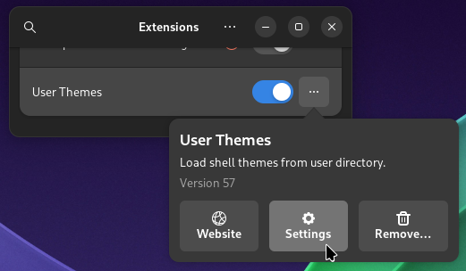
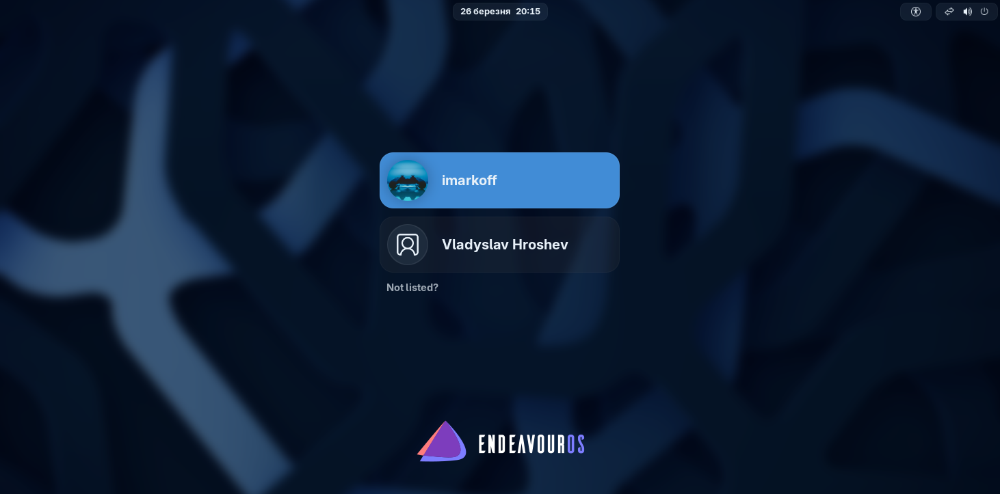
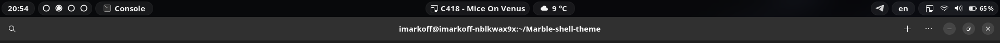
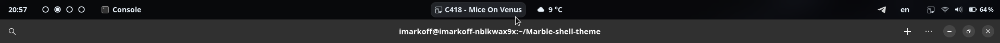
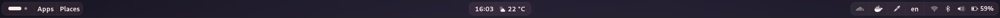
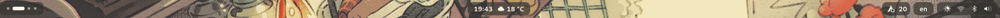
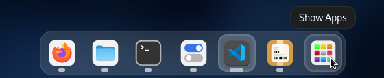

# Marble shell theme
Shell theme for GNOME DE. Based on https://www.pling.com/p/1939902/.


## 🏞 Screenshots

<details><summary>Click me 🐈</summary>

Icon theme: https://github.com/vinceliuice/Colloid-icon-theme

#### Overview [[Blur My Shell](https://extensions.gnome.org/extension/3193/blur-my-shell/) / Light / Dark] ([Neon Gas Station](https://www.heroscreen.cc/2025/03/neon-gas-station-4k-wallpaper.html) - AI Generated)


#### Panel

#### Quick settings ([Fresh green leaves with fragile veins](https://www.pexels.com/photo/fresh-green-leaves-with-fragile-veins-6423448/) / [Close-Up Photo of Wrinkled Parchment Paper](https://www.pexels.com/photo/close-up-photo-of-wrinkled-parchment-paper-7233131/))


#### Modal dialog ([Wide Angle Photography of Mountain](https://www.pexels.com/photo/wide-angle-photography-of-mountain-1612559/))

#### Calendar & notifications


#### Dash ([Dash To Dock](https://extensions.gnome.org/extension/307/dash-to-dock/ "Dash To Dock"))
- Position and size:
  - Icon size: 42px.
- Appearance:
  - Shrink the dash.
  - Default opacity.


</details>

## 🚧 Requirements
- GNOME 42-48. Correct functionality on other versions is not guaranteed.
- [User Themes](https://extensions.gnome.org/extension/19/user-themes/ "User Themes") extension.
- Python 3.10 or higher.

## 💡 Installation

> [!IMPORTANT]  
> If you have another theme installed globally (changed the appearance of the login window (GDM)), please remove it before installing this theme.

1. Open the terminal.
2. Clone the git repository and change the directory:
   ```shell
   git clone https://github.com/imarkoff/Marble-shell-theme.git
   cd Marble-shell-theme
   ```
3. Run the program (install all accent colors, light and dark mode): 
   ```shell
   python install.py -a
   ```
   - [more vibrant color](./readme-images/qs.png?raw=true) in active buttons:
      ```shell
      python install.py -a --filled
      ``` 
4. After successful file creation open Extensions app, go to `User Themes - ··· - Settings`.

5. Select the shell theme you want.

> [!TIP]
> For updating the theme, run the `git pull` command in the `Marble-shell-theme` directory and run the program again. 
> If Marble theme is used, updates will be applied automatically.

> [!TIP]
> If you want to install only one color, use the `--red`, `--yellow`, `--green`, `--blue`, `--purple`, `--gray` option.

Want to install a custom color, group buttons in the panel, use launchpad icon or some other tweaks?
See the [installation tweaks](#-installation-tweaks) section for more information.

If you want to remove the theme, see the [uninstallation](#%EF%B8%8F-uninstallation--reinstallation) section.

## 🖥️ GDM theme


> **Image:** [Network Abstract](https://4kwallpapers.com/abstract/network-abstract-background-blue-background-5k-8k-8270.html).
> 
> **Config:** `sudo python install.py --gdm --blue --filled --gdm-image /path/to/image.jpg --gdm-blur=40 --gdm-darken=30`

> [!WARNING]  
> I am not responsible for any damage caused by the installation of the theme. If you have any problems, please open an issue.

### 🚧 Additional requirements
- `glib2-devel` (`libglib2.0-dev` on Debian-based distros).
- `imagemagick` (if you want to apply filters to the background image).

1. Open the terminal.
2. Go to the directory with the theme.
3. Run the program with the `--gdm` option
   ```shell
   sudo python install.py --gdm (--your color) (--is filled)
   ```
    - Example:
        ```shell
        sudo python install.py --gdm --blue --filled
        ```
        ```shell
        sudo python install.py --gdm --gray --gdm-image /path/to/image.jpg --gdm-blur=40 --gdm-darken=30
        ```
4. After successful file restart GDM service:
   ```shell
   sudo systemctl restart gdm
   ```

- 🗑️ If you want to remove the theme or theme is broken, run the program with the `--remove` option:
    ```shell
    sudo python install.py --gdm -r
    ```
- ☠️ If you got a death screen, you can switch to the console with the `Ctrl + Alt + F3` key combination, log in, go to the `Marble-shell-theme` directory and run the command above. If it doesn't help, try reinstalling `gnome-shell` package.


## 🏮 Installation tweaks

> [!TIP]
> Wanna use accent color from your favorite wallpaper? Use [Chromaflow](https://github.com/Felixdiamond/chromaflow).

#### Install default color

| Option    | Description                  |
|-----------|------------------------------|
| -a, --all | Install all available colors |
| --red     | red theme only               |
| --yellow  | yellow theme only            |
| --green   | green theme only             |
| --blue    | blue theme only              |
| --purple  | purple theme only            |
| --gray    | gray theme only              |

> [!TIP]
> You can install several themes in one string: `python install.py --red --green --blue`

> [!TIP]
> If you don't like these colors, you can change them in the `colors.json` file (after the `elements`).

#### Install custom color
| Option | Secondary option | Description                              |
|--------|------------------|------------------------------------------|
| --hue  | (0 - 360)        | Generate theme from Hue prompt [0 - 360] |
| --name | NAME             | Custom theme name                        |

#### Theme colors
| Option       | Description                                                       |
|--------------|-------------------------------------------------------------------|
| --filled     | Make accent color [more vibrant](./readme-images/qs.png?raw=true) |
| -O, --opaque | Make background color opaque (by default is translucent)          | 

#### Optional theme tweaks
| Option | Secondary option | Description                                                |
|--------|------------------|------------------------------------------------------------|
| --mode | light / dark     | light / dark theme only                                    |
| --sat  | (0 - 250)        | custom color saturation (<100% - reduce, >100% - increase) |

#### GDM tweaks

| Option        | Secondary option         | Description                 |
|---------------|--------------------------|-----------------------------|
| --gdm-image   | /absolute/path/to/image/ | set background image to GDM |
| --gdm-blur    | 0+                       | apply blur to image (px)    |
| --gdm-darken  | 0 - 100                  | darken image (%)            |
| --gdm-lighten | 0 - 100                  | lighten image (%)           |

#### Panel tweaks

**Panel default size**


**Panel without button background**


**Grouped buttons in the panel**


**Floating panel**


| Option                     | Secondary option | Description                                            |
|----------------------------|------------------|--------------------------------------------------------|
| -Pds, --panel-default-size |                  | set default panel size                                 |
| -Pnp, --panel-no-pill      |                  | remove panel button background                         |
| -Ptc, --panel-text-color   | #abcdef          | custom panel HEX(A) text color                         |
| --wider-panel              |                  | make the panel a bit wider                             |
| --panel-grouped-buttons    |                  | group buttons in the panel                             |
| --floating-panel           |                  | make the panel floating (transparent panel background) |

#### Overview tweaks

**Launchpad icon**



| Command     | Description                                   |
|-------------|-----------------------------------------------|
| --launchpad | Change Show Apps icon to macOS Launchpad icon |

#### Examples
| Command                                                   | Description                                                              |
|-----------------------------------------------------------|--------------------------------------------------------------------------|
| -a                                                        | Install all accent colors with light & dark mode                         |
| --all --mode dark                                         | Install all accent colors with dark mode only                            |
| --purple --mode=light                                     | Install purple accent color with light mode only                         |
| --hue 150 --name coldgreen                                | Install custom coldgreen accent color, light & dark mode                 |
| --red --green --sat=70                                    | red, green accent colors, 70% of the stock saturation                    |
| --hue=200 --name=grayblue --sat=50 --mode=dark            | custom grayblue accent color, 50% of the stock saturation, dark mode     |
| --gdm --blue --gdm-image /path/to/image.jpg --gdm-blur=40 | Install GDM theming in blue color with own GDM background image and blur |


## 🗑️ Uninstallation / Reinstallation

- To remove the theme, run the program with the `--remove` option:
    ```shell
    python install.py -ra
    ```
- To reinstall the theme, run the program with the `--reinstall` option:
    ```shell
    python install.py -ri -a  # (other installation options)
    ```
  
> [!TIP]
> If you want to remove the GDM theme, use the `--gdm` option with the `--remove` option.


The program allows you to specify the color of the theme and the mode to remove.
For example, to remove purple and green themes in light mode, use the command:
```shell
python install.py -r --purple --green --mode light
```

Also, you can use the command above to reinstall purple and green themes in light mode with the `--reinstall` option.
```shell
python install.py -ri --purple --green --mode light
```

#### Options

| Option           | Description           |
|------------------|-----------------------|
| -r, --remove     | Remove the theme      |
| -ri, --reinstall | Reinstall the theme   |